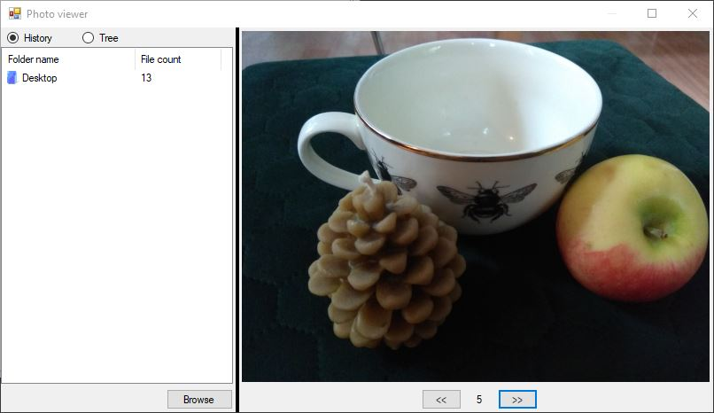

# :camera: Photo viewer
Browse images from your hard drive. Opened locations can be displayed as a list or a tree hierarchy. Locations that are already imported are marked with blue folder icon. Red folder icon determines a location that was not imported yet.

